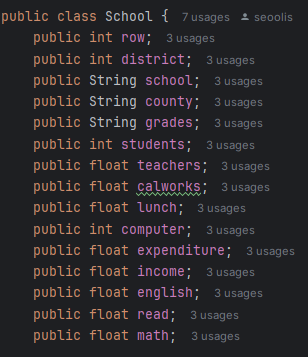
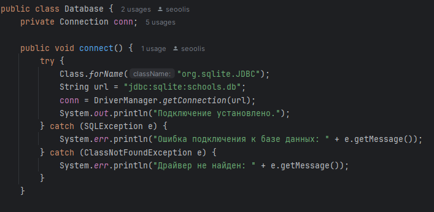
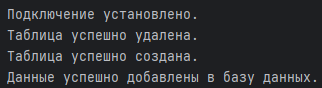
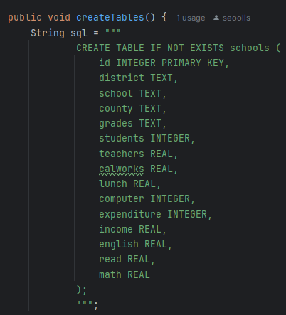
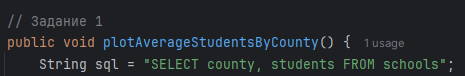
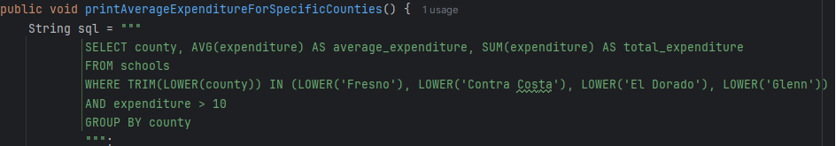
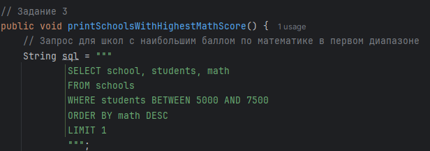
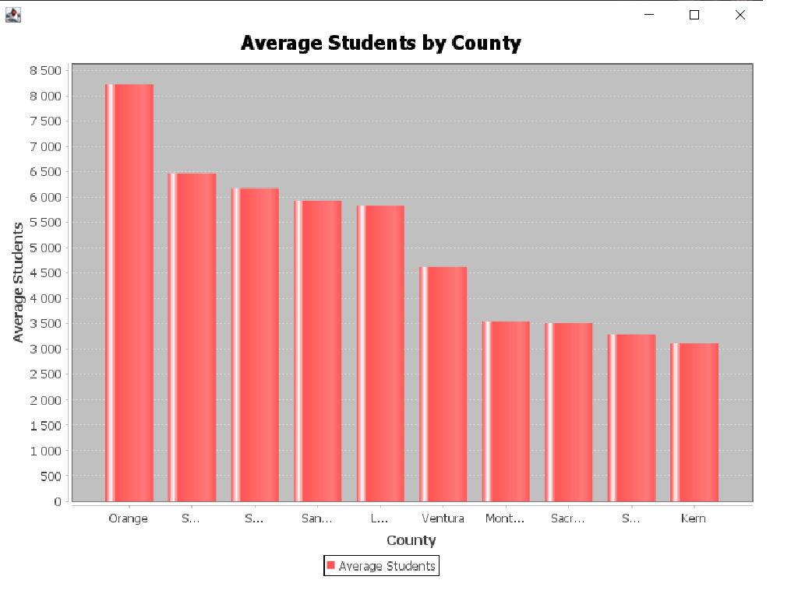
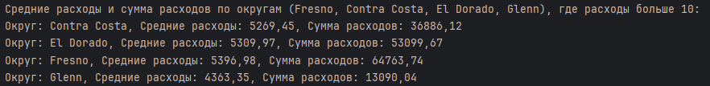
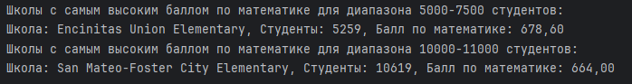

# Java-Final-Project-3-Sem
ULearn. Финальный проект по курсу «Java. Основы программирования на РТФ».

> **Выполнила**: Малышева Вероника Евгеньевна.

> **Группа**: РИ-230944 (АТ-02).

> **Вариант**: 2 (Школы, Schools).

В этом семестровом проекте было необходимо реализовать следующие задачи:

1. Выбрать свой вариант задания согласно номеру в таблице.

В моём случае - это второй вариант. CSV-файл содержал в себе данные о школах.

2. Разработать набор классов с необходимым составом полей и методов для хранения и обработки всех данных, хранящихся в CSV-файле вашего варианта задания.

3. Распарсив данные в файле CSV, нужно по ним создать набор объектов, заполнив все необходимые поля.

4. Создать файл БД SQL Lite и подключить ее к проекту.

После запуска программы, подключение к базе данных и работа с данными в базе данных выглядит так:

5. В БД создать набор таблиц (по 3-ей нормальной форме) согласно набору объектов.

6. Все данные из набора объектов сохранить в БД.

7. Сделать набор SQL-запросов к БД согласно своему варианту задания.

Для первого задания нужно было построить график по среднему количеству студентов в 10 различных странах на мой выбор. Запрос для данного задания выглядит так:

Для второго задания нужно было вывести в консоль среднее кол-во расходов в четырёх определённых городах, у которых расход был больше 10. Запрос для данного задания выглядит так:
 

Для третьего задания нужно было вывести в консоль учебное заведение, с количеством студентов равному от 5000 до 7500 и с 10000 до 11000, с самым высоким показателем по математике. Запрос для данного задания выглядит так:

8. Полученные данные вывести в текстовом виде в консоль, сделать скриншоты всех полученных данных.

9. Числовые данные по заданию визуализировать в виде диаграмм, сделать скриншоты всех полученных данных.

10. Для проекта создать открытый репозиторий на github и закоммитить туда всю работу по проекту.

11. В файле README описать последовательность работы по вашему проекту, а также прикрепить все скриншоты.

12. Ссылку на github проект прикрепить в этом задании.

**Задание 1**

Постройте график по среднему количеству студентов, в 10 различных странах, взять на свой выбор.

**Задание 2**

Выведите в консоль среднее количество расходов(expenditure) в Fresno, Contra Costa, El Dorado и Glenn, у которых расход больше 10.

Условия задания для меня оказались недостаточно ясны, поэтому я вывела как средние расходы, так и общую сумму расходов для каждого из четырёх городов:

**Задание 3**

Выведите в консоль учебное заведение, с количеством студентов равному от 5000 до 7500 и с 10000 до 11000, с самым высоким показателем по математике (math).

